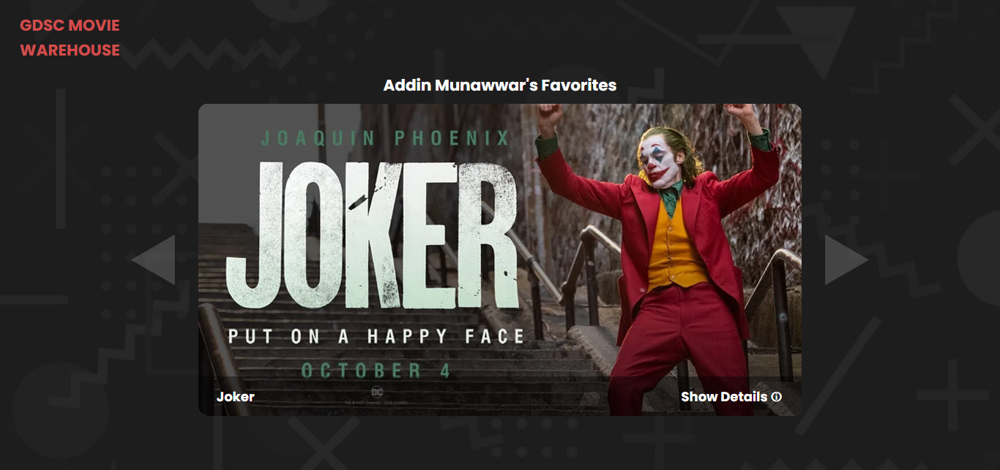

# GDSC-Movie Warehouse
#### **Greetings Everyone** 🐸👋. I just made this website that shows my favorite movies throughout my life. Hopefully, I can keep updating this website as my life goes on. This website was initially made to fulfill my task as a member of Google Developer Student Club of Bandung Institute of Technology 👨‍🎓, but i might develop this further in the future.  

# Features

#### Here is a first look at my website. Just a one big space with a **carousel** in the middle and a logo at the top left. Such a simple design, but it's more than enough. First thing that you might notice is there are two arrows that can navigate you through the movies I pick. Here is the demo

#### When you hover on the poster, there will be a **trailer** of that movie played. On the top left, there is also a **audio button** where you can toggle mute and unmute the trailer. Here is the demo

#### The last feature is the **details button**. On the bottom right of the carousel, you can toggle the details wether it's shown or not. The detail contains title, rating(imdb), and short synopsis. Here is the demo

#### So that's sum up the core features of this website. In the future, I'm planning to fetch the movie data from a real database, which i can't do yet right now.  
#### Hope we meet again in future occasion 😎. But for now, i guess **Goodbye** 🐸👋
